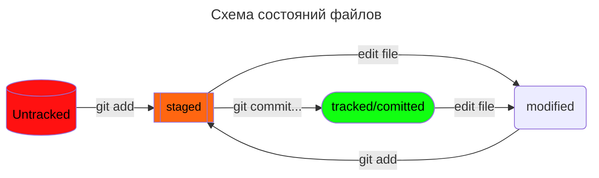

## ЗАГОЛОВОК

Описание проекта **GITPRACTIC**

---

[Ссылка](http://localyjst/gitpractic/ "Проект 'GITPRACTIC'") на проект **GITPRACTIC**.

### Описание проекта **GITPRACTIC**

```mermaid
---
title: Схема состояний файлов
---
graph LR;
id3[(Untracked)]:::notyet -- "git add" --> id1[["**staged**"]]:::podyet;
id1[[staged]] -- "git commit..." --> id2([tracked/comitted]):::yet;
id1[[staged]] -- "edit file" --> id("modified");
id("modified") -- "git add" --> id1[[staged]];
id2([tracked/comitted]) -- "edit file" --> id("modified");
click id3 callback "Неотслеживаемые";
classDef notyet fill:#f11, color:#000;
classDef podyet fill:#f61, color:#000, font-size:11pt;
classDef yet fill:#1f1, color:#000;
%% Описание схемы
```
