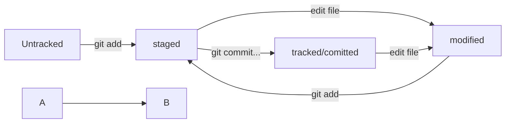

## ЗАГОЛОВОК

Описание проекта **GITPRACTIC**

---

[Ссылка](http://localyjst/gitpractic/ "Проект 'GITPRACTIC'") на проект **GITPRACTIC**.

### Описание проекта **GITPRACTIC**

```mermaid
graph LR;
Untracked -- "git add" --> staged;
staged -- "git commit..." --> tracked/comitted;
staged -- "edit file" --> modified;
modified -- "git add" --> staged;
tracked/comitted -- "edit file" --> modified;
%% Описание схемы:
  A --> B
```
